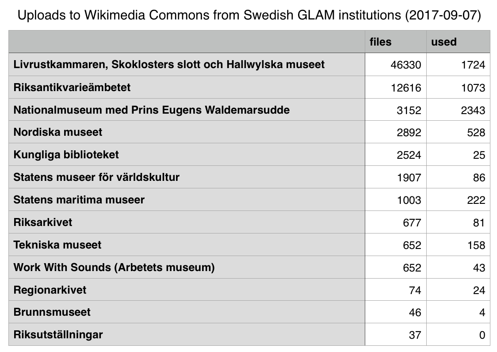

## Swedish GLAMwiki stats

Last updated: 2017-09-07

### List of institutions

* Livrustkammaren, Skoklosters slott och Hallwylska museet / [Usage stats](https://tools.wmflabs.org/glamtools/glamorous.php?doit=1&category=Images+from+Livrustkammaren+och+Skoklosters+slott+med+Stiftelsen+Hallwylska+museet&use_globalusage=1&ns0=1&depth=9&projects[wikipedia]=1&projects[wikimedia]=1&projects[wikisource]=1&projects[wikibooks]=1&projects[wikiquote]=1&projects[wiktionary]=1&projects[wikinews]=1&projects[wikivoyage]=1&projects[wikispecies]=1&projects[mediawiki]=1&projects[wikidata]=1&projects[wikiversity]=1)
* Riksantikvarieämbetet / [Usage stats](https://tools.wmflabs.org/glamtools/glamorous.php?doit=1&category=Images+from+the+Swedish+National+Heritage+Board&use_globalusage=1&ns0=1&depth=9&projects[wikipedia]=1&projects[wikimedia]=1&projects[wikisource]=1&projects[wikibooks]=1&projects[wikiquote]=1&projects[wiktionary]=1&projects[wikinews]=1&projects[wikivoyage]=1&projects[wikispecies]=1&projects[mediawiki]=1&projects[wikidata]=1&projects[wikiversity]=1)
* Nationalmuseum / [Usage stats](https://tools.wmflabs.org/glamtools/glamorous.php?doit=1&category=Images+from+the+Nationalmuseum+Stockholm&use_globalusage=1&ns0=1&depth=9&projects[wikipedia]=1&projects[wikimedia]=1&projects[wikisource]=1&projects[wikibooks]=1&projects[wikiquote]=1&projects[wiktionary]=1&projects[wikinews]=1&projects[wikivoyage]=1&projects[wikispecies]=1&projects[mediawiki]=1&projects[wikidata]=1&projects[wikiversity]=1)
* Nordiska museet / [Usage stats](https://tools.wmflabs.org/glamtools/glamorous.php?doit=1&category=Images+from+Nordiska+museet&use_globalusage=1&ns0=1&depth=9&projects[wikipedia]=1&projects[wikimedia]=1&projects[wikisource]=1&projects[wikibooks]=1&projects[wikiquote]=1&projects[wiktionary]=1&projects[wikinews]=1&projects[wikivoyage]=1&projects[wikispecies]=1&projects[mediawiki]=1&projects[wikidata]=1&projects[wikiversity]=1)
* Kungliga biblioteket / [Usage stats](https://tools.wmflabs.org/glamtools/glamorous.php?doit=1&category=Images+from+the+National+Library+of+Sweden&use_globalusage=1&ns0=1&depth=9&projects[wikipedia]=1&projects[wikimedia]=1&projects[wikisource]=1&projects[wikibooks]=1&projects[wikiquote]=1&projects[wiktionary]=1&projects[wikinews]=1&projects[wikivoyage]=1&projects[wikispecies]=1&projects[mediawiki]=1&projects[wikidata]=1&projects[wikiversity]=1)
* Statens museer för världskultur / [Usage stats](https://tools.wmflabs.org/glamtools/glamorous.php?doit=1&category=Media+from+the+National+Museums+of+World+Culture&use_globalusage=1&ns0=1&depth=9&projects[wikipedia]=1&projects[wikimedia]=1&projects[wikisource]=1&projects[wikibooks]=1&projects[wikiquote]=1&projects[wiktionary]=1&projects[wikinews]=1&projects[wikivoyage]=1&projects[wikispecies]=1&projects[mediawiki]=1&projects[wikidata]=1&projects[wikiversity]=1)
* Statens maritima museer / [Usage stats](https://tools.wmflabs.org/glamtools/glamorous.php?doit=1&category=Images+from+Statens+maritima+museer&use_globalusage=1&ns0=1&depth=9&projects[wikipedia]=1&projects[wikimedia]=1&projects[wikisource]=1&projects[wikibooks]=1&projects[wikiquote]=1&projects[wiktionary]=1&projects[wikinews]=1&projects[wikivoyage]=1&projects[wikispecies]=1&projects[mediawiki]=1&projects[wikidata]=1&projects[wikiversity]=1)
* Riksarkivet / [Usage stats](https://tools.wmflabs.org/glamtools/glamorous.php?doit=1&category=Images+from+the+National+Archives+of+Sweden&use_globalusage=1&ns0=1&depth=9&projects[wikipedia]=1&projects[wikimedia]=1&projects[wikisource]=1&projects[wikibooks]=1&projects[wikiquote]=1&projects[wiktionary]=1&projects[wikinews]=1&projects[wikivoyage]=1&projects[wikispecies]=1&projects[mediawiki]=1&projects[wikidata]=1&projects[wikiversity]=1)
* Tekniska museet / [Usage stats](https://tools.wmflabs.org/glamtools/glamorous.php?doit=1&category=Images+from+Tekniska+museet&use_globalusage=1&ns0=1&depth=9&projects[wikipedia]=1&projects[wikimedia]=1&projects[wikisource]=1&projects[wikibooks]=1&projects[wikiquote]=1&projects[wiktionary]=1&projects[wikinews]=1&projects[wikivoyage]=1&projects[wikispecies]=1&projects[mediawiki]=1&projects[wikidata]=1&projects[wikiversity]=1)
* Work With Sounds (Arbetets museum) / [Usage stats](https://tools.wmflabs.org/glamtools/glamorous.php?doit=1&category=Media+from+Work+With+Sounds&use_globalusage=1&ns0=1&depth=9&projects[wikipedia]=1&projects[wikimedia]=1&projects[wikisource]=1&projects[wikibooks]=1&projects[wikiquote]=1&projects[wiktionary]=1&projects[wikinews]=1&projects[wikivoyage]=1&projects[wikispecies]=1&projects[mediawiki]=1&projects[wikidata]=1&projects[wikiversity]=1)
* Regionarkivet / [Usage stats](https://tools.wmflabs.org/glamtools/glamorous.php?doit=1&category=Images+from+Regionarkivet&use_globalusage=1&ns0=1&depth=9&projects[wikipedia]=1&projects[wikimedia]=1&projects[wikisource]=1&projects[wikibooks]=1&projects[wikiquote]=1&projects[wiktionary]=1&projects[wikinews]=1&projects[wikivoyage]=1&projects[wikispecies]=1&projects[mediawiki]=1&projects[wikidata]=1&projects[wikiversity]=1)
* Brunnsmuseet / [Usage stats](https://tools.wmflabs.org/glamtools/glamorous.php?doit=1&category=Media+provided+by+Brunnsmuseet&use_globalusage=1&ns0=1&depth=9&projects[wikipedia]=1&projects[wikimedia]=1&projects[wikisource]=1&projects[wikibooks]=1&projects[wikiquote]=1&projects[wiktionary]=1&projects[wikinews]=1&projects[wikivoyage]=1&projects[wikispecies]=1&projects[mediawiki]=1&projects[wikidata]=1&projects[wikiversity]=1)
* Riksutställningar / [Usage stats](https://tools.wmflabs.org/glamtools/glamorous.php?doit=1&category=Images+from+Riksutställningar&use_globalusage=1&ns0=1&depth=9&projects[wikipedia]=1&projects[wikimedia]=1&projects[wikisource]=1&projects[wikibooks]=1&projects[wikiquote]=1&projects[wiktionary]=1&projects[wikinews]=1&projects[wikivoyage]=1&projects[wikispecies]=1&projects[mediawiki]=1&projects[wikidata]=1&projects[wikiversity]=1)
